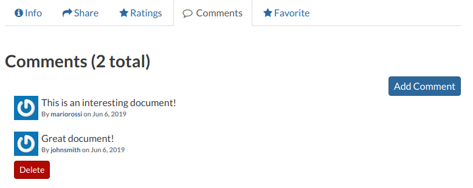
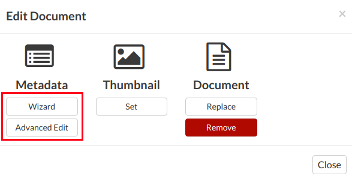
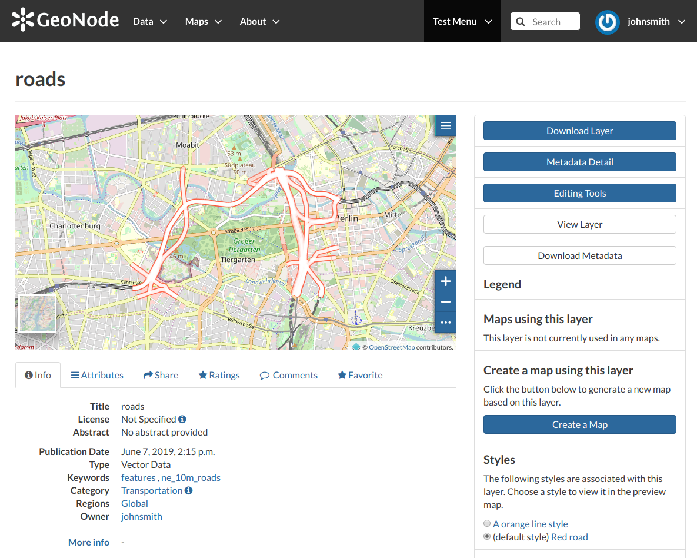

GEONODE PLATFORM DOCUMENTATION
============================================================================

>  style="font-variant:small-caps;">CLIENT: GREATER VIRUNGA TRANSBOUNDARY
> COLLABORATION
>
>  style="font-variant:small-caps;">PROJECT: GEONODE DATA
> MANAGEMENT
>
>  style="font-variant:small-caps;">CONSULTANT: BERNARD WRIGHT

*Submitted on: 30 March 2021*

*Point of Contact Bernard Wright*

*Managing Director*

*Geo Gecko*

> *Plot 8 Kanjokya Street*
>
> *Kamwokya*
>
> *Kampala*
>
> *Uganda*
>
> *+256 787 428 146*
>
> *bernard@geogecko.com*

INTRODUCTION
==========================================================

GeoNode is a geospatial content management system, a platform for the
management and publication of geospatial data. It brings together mature
and stable open-source software projects under a consistent and
easy-to-use interface allowing non-specialized users to share data and
create interactive maps.

Data management tools built into GeoNode allow for integrated creation
of data, metadata, and map visualization. Each dataset in the system can
be shared publicly or restricted to allow access to only specific users.
Social features like user profiles and commenting and rating systems
allow for the development of communities around each platform to
facilitate the use, management, and quality control of the data the
GeoNode instance contains.

It is also designed to be a flexible platform that software developers
can extend, modify or integrate against to meet requirements in their
own applications.

This is a template document sourced from the official Documentation of
the Geonode open source software developed by the Open Source Geospatial
Foundation (OSGeo) to guide in the use of the GVTC geonode.

GeoNode Users Guide
===================

[Interacting with Users and Groups]
===================================

**Viewing other users information** 
------------------------------------

Once your account is created, you can view other accounts on the system.
------------------------------------------------------------------------

To see information about other users on the system, click on the
“People” option from the “About” drop down menu (see screenshot below)

*About menu - People link*

A page having a list of registered users will pop up.

*List of the registered users*

The *Search* tool is very useful in case of many registered users, type
the name of the user you are looking for in the input text field to
filter the users list. Select a user and click on their *username* to
access the user details page.

**User details**
----------------

In this page the main information about the user is shown: personal
information (name, surname, organization and so on…) and the resources
the user owns (layers, maps and documents).

Through the User Activities link, on the right side of the page, it is
possible to visualize all the activities the user has done.

***User activities***

The Message User link lets you to contact other users, see the next
section to read more about that.

It is also possible, in GeoNode, to see the recent activities of all
users through the Recent Activities link of the user menu.

*Recent Activities link*

In the picture below an example of a user's recent activities.

*Recent Activities*

As you can see, you can decide whether to see only the activities
related to layers or those related to maps or comments by switching the
tabs.

**Contacting other users**
--------------------------

GeoNode allows you to communicate by message with other registered users
and groups.

To send a message to some user and/or groups you can follow the link
Message User from your *Profile* page or from the *Profile* details page of that user.

**Send message to users and groups**
------------------------------------

Insert your content, type a subject and click on Send message to send
the message to the users and groups you have selected.

You will be redirected to the *Conversation* details page related to the
subject.

*Your message*

**The Inbox page**
------------------

You can view your conversations in your *Inbox* page, reachable through
the Back to inbox button (see the picture above) or from the Inbox link
of the user menu.

*Inbox link*

The picture below shows how your *Inbox* page should look like.

*Inbox page*

In *Inbox* all the unread messages are listed. You haven’t received any
message yet so your *Inbox* is empty. If you switch to the *All* tab you
can see all the conversations you are involved in.

> 

*All your conversations*

When some user sends a reply to your message your *Inbox* shows it, see
the picture below for an example.

*A reply to your message*

You can open the *Conversation* details by clicking on the *Subject*
link.

*Conversation details*

As you can see in the picture above, in the *Conversation* page you have
the ability to write a quick reply. Type your message in the text box
and click on Send Reply to do that.

In the *Inbox* page there is also the Create Message button that
provides you a quick link to the message creation form.

Data
=====

The GeoNode welcome page shows a variety of information about the
current GeoNode instance.

You can explore the existing data using many search tools and filters
or through the links of the navigation bar at the top of the page.

There are three main types of resources that GeoNode can manage:

1.  Documents

2.  Layers

3.  Maps

Documents and layers can be accessed from the Data menu of the
navigation bar.

*Data menu*

The Maps menu lets you view already existing maps and also create new
maps.

*Maps menu*

**Documents**
-------------

GeoNode allows to publish tabular and text data and to manage metadata
and associated documents.

Documents can be uploaded directly from your local disk.

The following documents types are allowed: .doc, .docx, .gif, .jpg,
.jpeg, .ods, .odt, .odp, .pdf, .png, .ppt, .pptx, .rar, .sld, .tif,
.tiff, .txt, .xls, .xlsx, .xml, .zip, .gz, .qml.

Through the document details page is possible to view, download and
manage a document.

**Layers**
----------

Layers are a primary component of GeoNode.

Layers are publishable resources representing a raster or vector spatial
data source. Layers also can be associated with metadata, ratings, and
comments.

By clicking the Layers link you will get a list of all published layers.
If logged in as an administrator, you will also see the unpublished
layers in the same list.

GeoNode allows the user to upload vector and raster data in their
original projections using a web form.

Vector data can be uploaded in many different formats (ESRI Shapefile,
KML and so on…). Satellite imagery and other kinds of raster data can be
uploaded as GeoTIFFs.

**Maps**
--------

Maps are a primary component of GeoNode.

Maps are composed of various layers and their styles. Layers can be both
local layers in GeoNode as well as remote layers either served from
other WMS servers or by web service layers such as Google or MapQuest.

GeoNode maps also contain other information such as map zoom and extent,
layer ordering, and style.

You can create a map based on uploaded layers, combine them with some
existing layers and a remote web service layer, share the resulting map
for public viewing. Once the data has been uploaded, GeoNode lets the
user search for it geographically or via keywords and create maps. All
the layers are automatically reprojected to a web mercator for maps
display, making it possible to use popular base maps such as
[OpenStreetMap](https://www.openstreetmap.org).

[Managing Documents]
====================

**Uploading Documents**
-----------------------

GeoNode allows users to share reports, conceptual notes, posters,
spreadsheets, etc. A wide range of documents files can be hosted on the
platform, including text files (.doc, .docx, .txt, .odt), spreadsheets
(.xls, .xlsx, .ods), presentations (.ppt, .pptx, .odp), images (.gif,
.jpg, .png, .tif, .tiff), PDF, zip files (.rar, .zip, .gz), SLD, XML or
QML files.

Note:

Only authenticated users can upload data into GeoNode.

*Documents* uploading is accessible from two positions:

-   the Upload Documents button of the *Documents Search* page\
    \
    \
    *Documents Upload button\
    \
    *

The Upload Document link of the Data menu in the navigation bar\
\
\
*Document Upload link*

The *Document Upload* page looks like the one shown in the picture
below.

> 
> *Document Upload page*

In order to upload a document:

1.  select a file from your disk or enter a URL address if the document
    > is stored on the internet

2.  insert the title of the document

3.  select one or more published resources the document can be linked
    > to (optional)

4.  click the red Upload button

At the end of the uploading process you will be driven to the *Metadata*
page to fill out other information about the document. See the next
section to learn more.

> ○ Document formats allowed and accepted
>
> ○ Accessing documents
>
> ○ Document metadata

Filling the Document Metadata
-----------------------------

Metadata contains all the information related to the document: they are its ID card. They provide essential information for its identification and its comprehension. Metadata also makes the document more easily retrievable through search by other users.

Editing a document’s metadata is done in three steps (*Basic Metadata*,
*Location and Licenses*, *Optional Metadata*). The first two steps are
mandatory (no documents will be published if the required information is
not provided) whereas the last one is optional.

1.  On the **Basic Metadata** page, the essential information that has
    > to be filled is:

-   The *Title* of the document, which should be clear and
    > understandable;

-   The *Resources* the document should be linked to;

-   An *Abstract* on the document;

-   The *Creation/Publication/Revision* dates which define the time
    > period that is covered by the document;

-   The *Keywords*, which should be chosen within the available list.
    > The contributor searches for available keywords by clicking on the
    > searching bar, or on the folder logo representing, or by entering
    > the first letters of the desired word. Key-words should be
    > relevant to the imported document;

-   The *Category* in which the document belongs;

-   The *Group* to which the document is linked.

> *Document Basic Metadata*

Once all the fields are filled, click on the blue button Next &gt;&gt;
in the bottom right corner of the page.

**Note:** When a document is linked to some resources, you can see that
link on the *Resource Page*.

> *Documents linked to a Layer*

It will be also visible on the *Document Information* page.

> *Resources linked to a Document*

2.  On the **Location and Licenses** page, the following information
    > should be filled:

-   The *Language* of the document;

-   The *Regions*, which informs on the spatial extent covered by
    > the document. Proposed extents cover the following scales: global,
    > continental, regional, national;

-   The *Data Quality statement* (general explanation of the data
    > producer’s knowledge about the lineage of a dataset);

-   Potential *Restrictions* to sharing the document should be provided
    > in the Restrictions box.

> *Document Location and Licenses*
>
> Click on the blue button Next &gt;&gt; to go ahead to the next step.

3.  On the **Optional Metadata** page, complementary information can be
    > added:

-   The *Edition* to indicate the reference or the source of the
    > document;

-   The *Purpose* of the document and its objectives;

-   Any *Supplemental information* that can provide a better
    > understanding of the uploaded document;

-   The *Maintenance frequency* of the document;

-   The *Spatial representation type* used.

> *Responsible Parties*, *Owner* and *Permissions* are listed on the
> right side of the page, you can edit them.
>
> 
>
> *Document Optional Metadata*
>
> If all the mandatory information is filled out the document can be
> published, if not the Completeness progress bar warns you that
> something is missing.
>
> Click on the blue button Update to save information on the system.

Document Information
====================

From the *Documents Search Page* 
you can select the document you are interested in and see some basic
information about it. You can access the document details page by
clicking on its name. That page looks like the one shown in the picture
below.

*Document Information page*

On the page of a document, the resource is either directly displayed on
the page or accessible by clicking on the link provided under the title.

**Exploring the Tabs Sections**
-------------------------------

There is a *Tab Section* below the document, where you can first view
*Info* about the document.

The **Info Tab** section shows the document metadata such as its title,
abstract, date of publication etc. The metadata also indicates the user
who is responsible for uploading and managing this content, as well as
the group to which it is linked.

The **Share Tab** provides the social media links for the document to
share. There is also a link to share the document through email.

> 

*Document Sharing*

You can **Rate** the document through the *Ratings system*.

*Rate the Document*

In the **Comments Tab** section you can post your comment. Click on Add
Comment, insert your comment and click Submit Comment to post it.

*Document Comments*

Your comment will be added next to the last already existing comment. If
you want to remove it click on the red Delete button.

*Your Comment*

If you want this document in your *Favorites* (see [Updating the
Profile]),
open the **Favorite Tab** and click on Add to
Favorites.

*Your Favorite Comment*

GeoNode also supports the *EXIF (EXchangeable Image Format)* for jpeg
and tiff image documents. The *EXIF* means that additional information
(metadata) is stored within the image, so GeoNode allows you to see
those information in the **Exif Tab**.

*The EXIF tab*

**The Tools Section**
---------------------

On the right side of the *Document Page* you can see other useful
information such as the links to the resources linked to the document,
the document *Owner*, the *Point of Contact* and the *Metadata Author*.

> 

*Document useful tool*

In the same section of the *Document Page* you can find the following
useful tool:

-   Metadata Detail to explore in detail the document metadata (see the
    > next paragraph)

-   Download Document to download the document

-   Edit Document to change the document metadata, replace the file etc
    > (see [Document
    > Editing])

-   Download Metadata to download the whole set of metadata in various
    > formats\
    > \
    > \
    > Document Metadata download\
    > \

-   Change Document Permissions to assign permissions on the document to
    > users and groups (see [Changing the Document
    > Permissions]).

**Exploring Metadata Details**
------------------------------

When clicking on the Metadata Detail button the *Metadata Details Page*
will open.

> 

*Document Metadata Details page*

> It displays the whole set of available metadata about the document.
>
> Metadata are grouped in order to show the following types of
> information:

-   *Identification* to uniquely identify the document

-   *Owner*, the user who own the document

-   *Information*, the identification image, the Spatial Extent,
    > Projection System and so on

-   *Features*, Restrictions, Language and so on

-   *Contact Points*, the user available to have a contact

-   *References*, various links to the resource information

-   *Metadata Author*, the metadata author information

> ○ [Document
> Editing]

**Document Editing**

The [Document
Information]
page makes available useful tools for document editing. Click on the
Edit Document button to see what you can do to make changes. The picture
below shows you the *Editing Panel* that will appear on the screen.

> 

*Document Editing panel*

You can *Replace* the document file with another one by clicking on
Replace. It will drive you to the *Document Upload* page (see [Uploading
Documents])
where you can upload a new file.

The Remove button allows you to delete the document. You will have to
confirm that choice.

> 
*Document Removal confirmation*

The *Editing Panel* shows you also some links for editing the metadata
and the thumbnail. These actions will be explained more in depth in the
next paragraphs.

**Setting the Document Thumbnail**
----------------------------------

From the *Editing Panel*, it is also possible to *Set the Thumbnail* of
the document. Click on Set to open the *Thumbnail Uploading* page and
choose the image that will illustrate your document. You can either drag
and drop it in the *Drop files here* box or selecting from your folders
by clicking on *Choose Files*. Once this is done, click on the red
button Upload files. If the thumbnail has been successfully uploaded you
can see it by coming back to the document list. Click on the Explore
Documents button to check that.

> 

*Upload Document’s Thumbnail*

If no errors occur the following message will be shown.

> 

*Uploading success*

**Editing the Document Metadata**
---------------------------------

You can edit the metadata of your document through the buttons shown in
the red rectangle in the picture below.

> 

*Editing Metadata*

> The Wizard button drives you to the wizard described in the [Filling
> the Document
> Metadata]
> section. The Advanced Edit button takes you to a big form where all
> the available metadata of the document can be edited.
>
> Some information is mandatory such as the *Title* or the *Category*
> the document belongs to, some others are optional.
>
> 

*Editing Metadata*

In the example shown in the picture above, the information inside the
red rectangles have been changed. To save the changes click on Update,
you will be redirected to the document page.

Changing the Document Permissions
=================================

GeoNode encourages users to publicly share and make available for
download information uploaded on the platform. By default, anyone can
see and download a document. However, the document responsible can
choose to limit access to the document to some contributors and/or
groups.

Through the button shown in the picture below it is possible to manage
the document permissions.

> 

*The button to change permissions*

The Change Document Permissions button on the right side of the document
page allows to set up who can:

-   View the document;

-   Download it;

-   Edit its metadata;

-   Manage it (update, delete, change permissions, publish/unpublish).

See an example in the picture below.

> 

*Changing the Document permissions*

Usually that editing of metadata and the management of a document are in
charge of the responsible of the document, i.e. the contributor who
uploaded it and who has those permissions by default.

Once the permissions are set, click Apply changes to save them.

Layers Uploading
================

> The most important resource type in GeoNode is the *Layer*. A layer
> represents spatial information so it can be displayed inside a map.
>
> To better understand what we are talking about, let's upload your
> first layer.

The *Layer Uploading* page can be reached from the Upload Layer link of
the Data menu in the navigation bar.

> 
*Link for Layers Uploading*

There is also an Upload Layers button in the *Layers Page*.

> 

*Button for Layers Uploading*

The *Layers Uploading* page looks like the one in the picture below.

> 

*The Layers Uploading page*

> Through the Choose Files button you can select files from your disk,
> make sure they are valid raster or vector spatial data. You can also
> change the default *Permissions* settings (see [Changing the Layer
> Permissions]
> for further information on how to set permissions).
>
> Select the *charset*, then click on Upload files to start the process
> or click Clear to remove all the loaded files form the page.
>
> 

*Shapefile Uploading*

In this example the roads ESRI Shapefile, with all its mandatory files
(.shp, .shx, .dbf and .prj), has been chosen. A progress bar shows the
operation made during the layer upload and alerts you when the process
is over. When the process ends click the Layer Info to check the layer
has been correctly uploaded.

Using Remote Services
=====================

In GeoNode you can add new layers not only by loading them from your
disk but also using *Remote Services*. In this section you will learn
how to add a new service and how to load resources in GeoNode through
that.

Let’s try it!

Click on the Remote Services link of the Data menu in the navigation
bar.

> 

*Remote Services link*

The page that opens will contain the list of the available services.

> 

*Remote Services*

To configure a new service:

-   click on Register a new Service

-   type the *Service URL*

-   select the *Service Type
    > \
    > Service Types

-   click on Create

GeoNode supports three **types of remote services**:

-   Web Map Service
    > * Generic Web Map Service (WMS) based on a standard protocol for
    > serving georeferenced map images over the Internet. These images
    > are typically produced by a map server (like
    > [GeoServer](http://geoserver.org/)) from data provided by one or
    > more distributed geospatial databases. Common operations performed
    > by a WMS service are: *GetCapabilities* (to retrieve metadata
    > about the service, including supported operations and parameters,
    > and a list of the available layers) and *GetMap* (to retrieve a
    > map image for a specified area and content).\
    > \
    > Note\
    > \
    > Lots of WMS services are available on the internet, in this
    > example we used the https://demo.geo-solutions.it/geoserver/wms.

-   GeoNode Web Map Service
    > * Generally a WMS is not directly invoked; client applications
    > such as GIS-Desktop or WEB-GIS are used that provide the user with
    > interactive controls. A GeoNode WMS automatically performs some
    > operations and lets you to immediately retrieve resources.\
    > \
    > Note\
    > \
    > An example of GeoNode WMS is available
    > at http://dev.geonode.geo-solutions.it/geoserver/wms.

-   ArcGIS REST MapServer
    > * This map service provides basic information about the map,
    > including the layers that it contains, whether the map is cached
    > or not, its spatial reference, initial and full extents, whether
    > the service is allowed to export tiles and max tiles export
    > count, etc. A set of operations that manage the state and contents
    > of the service are allowed: Edit Service, Refresh, Update Tiles.
    > The URL should follow this pattern:
    > https://&lt;servicecatalog-url&gt;/services/&lt;serviceName&gt;/MapServer.\
    > \
    > Note\
    > \
    > Try the following service to better understand how it
    > works: https://sampleserver6.arcgisonline.com/arcgis/rest/services/USA/MapServer.

Once the service has been configured, you can load the resources you are
interested in through the *Import Resources* page where you will be
automatically redirected to. Take a look at the gif below to see the
whole process.

> 

*A new Remote Service*

> From the page where the services are listed, it is possible to click
> on the *Title* of a service. It opens the *Service Details* page.
>
> Each service has its own metadata such as the *Service Type*, the
> *URL*, an *Abstract*, some *Keywords* and the *Contact* user. You can
> edit those metadata through the form available from the Edit Service
> Metadata button of the *Service Details* page (see the picture below).
>
> 

*Remote Service metadata*

Changing the Layer Permissions
==============================

When creating or uploading a new Layer you have to set who can view,
download, edit and manage that Layer. By default only owners can edit
and manage layers, anyone can view and download them.

In order to modify the Layer *Permissions* settings you have to click
the Change the Layer Permissions button in the Layer page.

> 

*Change Layer Permissions*

Through the *Permissions Settings Panel* you can add or remove
permissions for users and groups. The picture below shows an example.

> 

*Layer Permissions settings for users and groups*

You can set the following types of permissions:

-   *View* allows to view the layer;

-   *Download* allows to download the layer;

-   *Change Metadata* allows to change the layer metadata;

-   *Edit Data* allows to change attributes and properties of the layers/features

-   *Edit Style* allows to change the layer style;

-   *Manage* allows to update, delete, change permissions, publish and unpublish the layer.

Note

When assigning permissions to a group, all the group members will have
those permissions. Be careful in case of editing permissions.

Click on Apply Changes to save these settings.

Layer Information
=================

> In this section you will learn more about layers. In the
> [Layers]
> section we explain how to find layers, now we want to go more in depth
> showing you how to explore detailed information about that.
>
> From the layers list page, click on the layer you are interested in.
> The *Layer Page* will open.
>
> 

*Layer Information*

As shown in the picture above, the *Layer Page* is divided into three
main sections:

1.  the *Layer Preview* section, under the title

2.  the *Tabs* section, under the layer preview

3.  the *Tools* section, on the right side of the page

**Layer Preview**
-----------------

The *Layer Preview* shows the layer in a map with very basic
functionalities:

-   the *Base Map Switcher* that allows you to change the base map;

-   the *Zoom in/out* tool to enlarge and decrease the view;

-   the *Zoom to max extent* tool for the zoom to fit the layer size;

-   the *Query Objects* tool to retrieve information about the map

-   the *Print* tool to print the preview.

> 

*Layer Preview*

The GeoNode map viewer is
[MapStore](https://mapstore2.geo-solutions.it/mapstore/#/) based, see
the [MapStore
Documentation](https://mapstore2.readthedocs.io/en/latest/) to learn
more.

**Tabs Sections**
-----------------

The *Layer Page* shows you some tabs sections containing different
information about the layer:

-   The tab *Info* is active by default. This tab section shows some
    > layer metadata such as its title, the abstract, date of
    > publication etc. The metadata also indicates the layer owner, what
    > are the topic categories the layer belongs to and which regions
    > are affected.\
    > \
    > \
    > \

-   The *Attributes* tab shows the data structure behind the layer. All
    > the attributes are listed and for each of them some
    > statistics (e.g. the range of values) are estimated (if
    > possible).\
    > \
    > \
    > *

-   The *Share* tab provides the links for the layer to share through
    > social media or email.\
    > \
    > \

-   You can *Rate* the layer through the *Rating system*.
    > \
    > \

-   In the *Comments* tab section you can post your comment. Click on
    > Add Comment, insert your comment and click Submit Comment to post
    > it.\
    > \
    > \
    > * Your comment will be added next to the last already
    > existing comment. If you want to remove it click on the red
    > Delete button.

-   If you want this layer in your *Favorites* (see [Updating the
    > Profile]),
    > open the *Favorite* tab and click on Add to Favorites.\
    > \
    > \

**Layer Tools**
---------------

In the right side of the *Layer Page* there are some buttons and
information that can help you to manage your layer. This paragraph will
cover only those tools which show layers information. The *Editing
Tools* will be explored in the [Layer
Editing]
section.

-   through the Download Layer button you can download your layer with some options.

-   the Metadata Detail button to see the layer metadata.

-   The Editing Tools button allows you to access many editing tools.

-   the View Layer button opens the layer loaded in a map.

-   the Download Metadata button allows you to download the layer metadata in various formats.

-   the *Legend* shows what the symbols and styles on the map are referring to.

-   in the *Map using this layer* section all the map which uses the layer are listed.

-   in the *Create a map using this layer*, the Create a Map button allows you to create a map from scratch using the layer.

-   The section *Add the layer to an existing map* shows you a dropdown menu in which all the maps the user can view are listed. The button Add to Map allows you to add the layer to the map you have selected in the previous menu.

-   The *Styles* section shows all the styles associated with the layer.
    > Click on the checkbox corresponding to one of the styles listed to
    > apply it the preview;\
    > \
    > \
    > Change the Layer Style in preview\

-   in the *Refresh Attributes and Statistics of this layer* section the
    > Refresh Attributes and Statistics allows GeoNode to refresh the
    > list of available Layer Attributes. If the option ‘WPS\_ENABLED’
    > has been also set on the backend, it will recalculate their
    > statistics too;

-   in the *Clear the Server Cache of this layer* section the Empty Tiled-Layer Cache allows to wipe the tile-cache of this layer;

-   The *About* section shows you the layer *Owner*, the *Contact* user and the *Metadata Author*.

Downloading Layers
==================

> At the top of the *Layer Page* there is the Download Layer button (see
> [Layer
> Information]).
> It provides access to the ability to extract geospatial data from
> within GeoNode.
>
> You will see a list of options of the supported export formats. You
> can choose the *Images* formats PNG, PDF, JPEG if you want to save a
> “screenshot-like” image of the layer.
>
> 

*Downloading Layers as Images*

You can also download the layer data, the supported export formats will
be listed in the *Data* tab. Click on your desired format to trigger the
download.

> 

*Downloading the Layer Data*

As shown in the image above, GeoNode allows you to download a subset of
data. Click on Do you want to filter it? to filter the layer data before
the download.

> 

*Downloading the Layer Data*

Layer Editing
=============

The Editing Tools button of the *Layer Page* (see [Layer
Information])
opens a panel like the one shown in the picture below.

> 

*The Layer Editing panel*

In that panel you can see many options grouped by four categories:

1.  *Metadata*

2.  *Styles*

3.  *Thumbnail*

4.  *Layer*

In this section you will learn how to edit a *Layer*, how to replace and
edit its data. See [Layers
Metadata]
to learn how to explore the layer *Metadata*, how to upload and edit
them. The *Styles* will be covered in a dedicated section, see [Layer
Styling].

**Setting the Layer Thumbnail**
-------------------------------

> The Thumbnail of the layer that will be displayed on the *Layers* list
> page can be changed by dragging and zooming on the layer preview to
> select which portion will be displayed, then by clicking on the Set
> button of the *Layer Editing* panel.
>
> A message will confirm the thumbnail has been correctly changed.
>
> 

*The Layer Editing panel*

It is also possible to manually upload a thumbnail by using the Upload
button of the *Layer Editing* panel. Using the “Upload Thumbnail” page
it is possible to enable the automatically generated thumbnail or upload
an image to be used in place of it.

> 

*The Upload Thumbnail panel*

**Replacing the Layer**
-----------------------

From the *Layer Editing* panel click on Replace to change the layer
source dataset. You will be driven to the *Replace Layer* page in which
Choose Files button allows you to select files from your disk.

> 

*Replace a Layer*

Once the *Charset* selected the upload process can be triggered by
clicking on Replace Layer. If no errors occur you will see a message
like the one in the picture below.

> 

*Replace Layer success*

We have replaced the *roads* dataset with the *railways* one. You can
see the differences in the *Layer Preview*.

> 

*Result of the Layer Replacement*

**Editing the Layer Data**
--------------------------

The Edit data button of the *Layer Editing* panel opens the *Layer*
within a *Map*.

> 

*Editing the Layer Data*

The *Attribute Table* panel of the *Layer* will automatically appear at
the bottom of the *Map*. In that panel all the features are listed. For
each feature you can zoom to its extent by clicking on the corresponding
*magnifying glass* icon
[]
at the beginning of the row, you can also observe which values the
feature assumes for each attribute.

Click the *Edit Mode*
[]
button to start an editing session.

Now you can:

-   Add new Features
    > * Through the *Add New Feature* button
    > []
    > it is possible to set up a new feature for your layer. Fill the
    > attributes fields and click
    > []
    > to save your change. Your new feature doesn’t have a shape yet,
    > click on []
    > to draw its shape directly on the *Map* then click on
    > []
    > to save it.\
    > \
    > \
    > *Add a New Feature to the Layer\
    > \
    > * Note\
    > \
    > When your new feature has a multi-vertex shape you have to
    > double-click the last vertex to finish the drawing.

-   Delete Features
    > * If you want to delete a feature you have to select it on the
    > *Attribute Table* and click on
    > [].\
    > \
    > \
    > *Delete a Feature\

-   *Change the Feature Attributes
    > * When you are in *Edit Mode* you can also edit the attributes
    > values changing them directly in the corresponding text fields.\
    > \
    > \

Once you have finished you can end the *Editing Session* by clicking on
the [] button.

By default the GeoNode map viewer is
[MapStore](https://mapstore2.geo-solutions.it/mapstore/#/) based, see
the [MapStore
Documentation](https://mapstore2.readthedocs.io/en/latest/) for further
information.

Layer Styling
=============

Maps are helpful because they allow you gain a deeper understanding of
your data by allowing you to visualize it in many different ways. So you
can tell different stories depending on how the data is presented. For
any given data or layer, you should explore different styling options
and choose the best style for that.

In GeoNode each layer has a *Default Style* which is determined by the
nature of the data you’re mapping. When uploading a new layer (see
[Layers
Uploading](https://docs.geonode.org/en/master/usage/managing_layers/uploading_layers.html#uploading-layers))
a new default style will be associated with it.

> 

*Default Style for Layers*

Referring to the example above, dark orange lines are not very good to
represent waterways so we would need to change this style. In the
following paragraphs you will learn how to create a new style starting
from given templates, how to edit a style, how to upload styles from
file and how to manage them.

**Creating new Styles**
-----------------------

In order to create a new style, open the *Layer Page* (see [Layer
Information](https://docs.geonode.org/en/master/usage/managing_layers/layer_info.html#layer-info))
and click on Editing Tools. Then click the Edit button in the *Styles*
section of the *Layer Editing* panel (see the picture below).

> 

*Edit Styles button*

The *Layer* will open in a new *Map*. The *Styles Panel* will show you
all the available styles for the layer and some useful tools.

> 

*The Styles Panel in the Map*

Now follow the steps below:

1.  Click the  button.
    > The *Style Templates Panel* will open.

> 
>
> *Create new Styles*

2.  Choose a *Style Template* from the list (both *CSS* and *SLD* styles are available).

> 
>
> *Style Templates*

3.  Click the button to add the *Style Template* to the styles list.

4.  Insert a *Title* and an *Abstract* (optional), then click on Save.

> *Title and Abstract for new Styles*

The style you have created is now added to the *Styles List*.

> 

*New Styles into the list*

You will also see this new style in the *Layer Page*.

> 

*The Layer Page with the new Style*

Now you can switch the style by clicking on the corresponding checkbox.

It would be nice to change the style in order to decrease the opacity of
the filling color as well as to reduce the lines width. The embedded
[MapStore](https://mapstore2.geo-solutions.it/mapstore/#/) makes
available a powerful *Style Editor* to accomplish that task. In the next
paragraph we will explain how.

**Editing the Layer Style**
---------------------------

The following steps show you how to edit styles:

1.  From inside the map open the *TOC (Table Of Content)* by clicking
    > the 
    > button

2.  Click on 

3.  Open the *Style* tab
    > 

> Note:
>
> Styles editing is allowed only to those users who have the needed
> permission. See [Changing the Layer
> Permissions](https://docs.geonode.org/en/master/usage/managing_layers/layer_permissions.html#layer-permissions)
> to read more)

4.  Select the *Style* and click on
    > 

5.  Edit the style. The *Style Editor* helps you to write valid styles
    > through the *Syntax Validator* which shows you a popup in case of
    > errors (see the picture below).

> *The Style Editor Syntax Validation*

6.  Click on 
    > to save your changes.

See the following gif to recap the whole process.

*The Style Editor*

> You can also decide to make your new style the *Default Style* of that
> layer. Click on 
> to do that.
>
> Click on 
> to delete the style.

**Uploading Styles**
--------------------

In GeoNode it is also possible to upload an existing style from a file.

Note

Currently only styles in **SLD (Style Layer Descriptor 1.0, 1.1)**
format can be uploaded in GeoNode.

From the *Layer Page* click on *Editing Tools* to open the *Editing
Tools* panel and follow the steps below:

1.  Click the Upload button of the *Styles* section

2.  Click on Choose Files and select your style from your disk

3.  Click on Upload files

Once the process has been finished the new *Style* will be visible in
the *Layer Page*.

**Managing Styles**
-------------------

Given a layer, you can manage all its styles in the *Styles Management
Page* accessible from the Manage button of the *Layer Editing* panel.

*Managing Styles*

In that page you can:

-   See the *Layer Name*

-   Add/remove styles to/from the *Available styles* list

-   Choose the *Layer Default Style* from the *Available styles* list

Click on Update Available Styles to save your changes.

Creating Maps
=============

In this section, we’ll create a *Map* using some uploaded layers,
combine them with some other layers from remote web services, and then
share the resulting map for public viewing.

In order to create new maps you can use:

-   the Create Map link of the *Maps* menu in the navigation bar

-   the Create Map button in the *Layer Page* (it creates a map using a specific layer)

-   the Create New Map button in the *Explore Maps* page

The new *Map* will open in a *Map Viewer* like the one in the picture
below.

*The Map Viewer*

> In the upper left corner the
> 
> button opens the [Table of Contents
> (TOC)](https://docs.geonode.org/en/master/usage/managing_maps/exploring_maps/toc.html#toc)
> of the *Map*. It allows to manage all the layers associated with the
> map and to add new ones from the *Catalog*.
>
> The *TOC* component makes it possible to manage layers overlap on the
> map by shifting their relative positions in the list (drag and drop
> them up or down in the list).
>
> It also allows to hide/show layers (
> 
> and 
> ), to zoom to layers extents (
> 
> ) and to manage their properties (
> 
> ).
>
> Once the map layers have been settled it is possible to save the *Map*
> by clicking on 
> and choosing Save as.

*Creating new Maps*

If you followed the steps above, you have just created your first *Map*.
Now you should see it in the *Explore Maps* page, see [Map
Information](https://docs.geonode.org/en/master/usage/managing_maps/map_info.html#map-info)
for further details.

We will take a closer look at the *Map Viewer* tools in the [Exploring
Maps](https://docs.geonode.org/en/master/usage/managing_maps/exploring_maps/index.html#exploring-maps)
section.

Map Information
===============

> As mentioned in the
> [Maps](https://docs.geonode.org/en/master/usage/data/finding_data.html#finding-maps)
> section, in GeoNode you can see your maps and all the published maps
> through the Explore Maps link of the navigation bar.
>
> Click on the title of the *Map* you are interested in to open its
> *Information* page, it should look like the following.

*The Map Information page*

The *Map Page* is divided into three main sections:

1.  the *Map Preview* section, under the title

2.  the *Tabs* section, under the layer preview

3.  the *Tools* section, on the right side of the page

**Map Preview**
---------------

The *Map Preview* shows the *Map* with very basic functionalities:

-   the *Base Map Switcher* that allows you to change the base map;

-   the *Zoom in/out* tool to enlarge and decrease the view;

-   the *Zoom to max extent* tool for the zoom to fit the layers extents;

-   the *Query Objects* tool to retrieve information about the map objects by clicking on the map;

-   the *Print* tool to print the preview.

*Map Preview*

See the [MapStore
Documentation](https://mapstore2.readthedocs.io/en/latest/) to learn
more.

**Tabs Sections**
-----------------

The *Map Information* page shows you some tabs sections containing
different information about the map:

-   The tab *Info* is active by default. This tab section shows some
    > metadata such as its Title, the License, the Publication Date etc.
    > The metadata also indicates the map owner and which regions
    > are involved. The Map Layers WMS GetCapabilities document link is
    > also provided.\

-   The *Share* tab provides the links for the map to share through social media or email.

-   You can *Rate* the map through the *Rating system*.

-   In the *Comments* tab section you can post your comment. Click on
    > Add Comment, insert your comment and click Submit Comment to post
    > it.\
    > * Your comment will be added next to the last already
    > existing comment. If you want to remove it click on the red
    > Delete button.

-   If you want this map in your *Favorites*, open the *Favorite* tab and click on Add to Favorites.

**Map Tools**
-------------

> In the right side of the *Map Information* page there are some tools
> that can help you to manage your maps. In this paragraph you will
> learn how to discover and retrieve information about maps.
>
> The following is a list of actions you can take in order to accomplish
> this task:

-   click the Download Map button, to download the map as image;

-   click the Metadata Detail button to see the map metadata, 

-   click the Editing Tools button to access many editing tools.

-   click the View Map button to open the map

-   see the *Map Layers* section to know which layers are used by the map (you can open the *Layer Page* by clicking on its name, available only for local layers);

-   click the Create a Map button of the *Copy this map* section to duplicate the map;

-   click the Publish Map WMS of the *Map WMS* section to publish local map layers as WMS layer group;

-   see the *About* section to know the map *Owner*, the *Contact* user and the *Metadata Author*.

Maps Metadata
=============

*Maps Metadata* can be explored by clicking the Metadata Detail button
from the *Map Information* page.

The *Map Metadata* page will open.

*The Map Metadata Details*

Lots of information is displayed on this page. Those information are
grouped as follow:

-   *Identification* to uniquely identify the map (Title, License, Publication Date and Regions. There are also some flags which tell you the state of the map, in particular if it is Approved and/or Published);

-   the map *Owner*;

-   *Information*, the Identification Image, the Spatial Extent, the Projection System and the Extent;

-   *Features*, Language, Supplemental and other Information;

-   *Contact Points*, the available user to get in contact;

-   *References*, links to the map and its metadata;

-   *Metadata Author*, information about the author of the metadata.

**Metadata Wizard**
-------------------

> Metadata provides essential information for the identification and the
> comprehension of the map. They also make the map more easily
> retrievable through the search tools.
>
> Those *Metadata* can be filled out through a three-steps *Wizard* in
> which you have to provide all mandatory information to complete the
> process. Those three steps are described below.

-   Basic Metadata
    > *Basic Map Metadata\
    > \
    > * In the first step the system asks you to insert the following
    > metadata (required fields are highlighted with red outlines):

    -   The *Thumbnail* of the map (click Edit to change it);

    -   The *Title* of the map, which should be clear and understandable;

    -   An *Abstract*; brief narrative summary of the content of the Map
        > Note\
        > \
        > The *Abstract* panel allows you to insert HTML code through a
        > *wysiwyg* text editor

    -   The *Creation/Publication/Revision Dates* which define the time period that is covered by the map;

    -   The *Keywords*, which should be chosen within the available list;

    -   The *Category* which the map belongs to;

    -   The *Group* which the map is linked to.

-   Click Next &gt;&gt; to go to the next step.

-   Location and Licenses
    > *Location and Licenses Metadata for Maps\
    > * The following list shows what kinds of metadata you are required
    > to enter (see also the picture below):

    -   The *Language* of the layer;

    -   The *License* of the dataset;

    -   The *Regions* covered by the layers extent. Proposed extents
        > cover the following scales: global, continental, regional,
        > national;

    -   The *Data Quality statement* (general explanation of the data
        > producer’s knowledge about the lineage of a dataset);

    -   Potential *Restrictions* on layer sharing.

-   No further mandatory metadata is required in the next step, so once the required fields have been filled out, a green Done button will be visible on the screen. Click Next &gt;&gt; to go to the next step or &lt;&lt; Back to go back to the previous step.

-   Optional Metadata
    > \
    > Optional Map Metadata\
    > \
    > * Complementary information are:

    > * The *Edition* of the map;

    > * The *Purpose* of the map and its objectives;

    > * Any *Supplemental information* that can provide a better understanding of the map;

    -   The *Maintenance frequency* of the map;

    -   The *Spatial representation type*, the method used to represent geographic information in the dataset;

    -   The users who are *Responsible* for the layer, its *Owner*, and the *Author* of its metadata;

If you miss some mandatory metadata the *Completeness* bar shows you a
red message like the one in the picture below.

**Metadata Advanced Editing**
-----------------------------

The Advanced Edit editing tool allows to change the map metadata. You
can find this button into the map *Editing Tools*.

*The Advanced Edit button*

Click on it to display the *Metadata Advanced Editing Page*. That page
allows you to edit all the layer metadata described in the previous
paragraph. Once you have finished to edit them click on Update to save
your changes.

From the Explore Maps link of the navigation bar you can reach the *Maps
List* page (see
[Maps](https://docs.geonode.org/en/master/usage/data/finding_data.html#finding-maps)).
Select a map you are interested in and click on it, the *Map Page* will
open.

Click on the View Map button to open the *Map Viewer*.

*The Map View*

The Map Viewer (based on
[MapStore](https://mapstore2.geo-solutions.it/mapstore/#/)) provides the
following tools:

-   the Table of Contents (TOC) to manage the map contents;

-   the *Basemap Switcher* to change the basemap (see the next paragraphs);

-   the *Search Bar* to search by location, name and coordinates;

-   the Options Menu Tools which contains the link to the *Print* tool, to the layers *Catalog* and to the *Measure* tool;

-   the *Sidebar* and its tools such as the *Zoom* tools and the *Get Features Info* tool;

-   the *Footer Tools* to manage the scale of the map, to track the mouse coordinates and change the CRS (Coordinates Reference System).

**Search Bar**
--------------

> The *Search Bar* of the map viewer allows you to find point of
> interests (POIs), streets or locations by name.
>
> Lets type the name of some place then select the first record.

The map will automatically re-center on that area delimiting it by a
polygon in the case of an area, by a line in the case of a linear shape
(e.g. streets, streams) and by a marker in the case of a point.

> 

**Sidebar Tools**
-----------------

> The *Map Viewer* also makes available the *Sidebar*. It is a
> navigation panel containing various tools that help you to explore the
> map such as tools for zooming, changing the extent and querying
> objects on the map.
>
> By default the *Sidebar* shows you the zooming buttons
> 
> and ,
> other options can be explored by clicking on
> 
> which expands/collapses the toolbar.

The *Sidebar* contains the following tools:

-   The *Query Objects on map* allows you to get feature information through the  button. It allows you to retrieve information about the features of some layers by clicking them directly on the map.
    > * When clicking on the map a new panel opens. That panel will show
    > you all the information about the clicked features for each active
    > loaded layer.

-   You can *Zoom To Max Extent* by clicking
    > .

-   You can switch between the previous and the next zoom level through
    > the *Go Back* button
    > 
    > and the *Go Forward* one
    > .

-   The *Switch to Full Screen*
    > 
    > button allows to have a full screen map.
